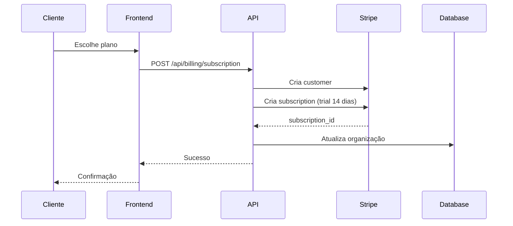
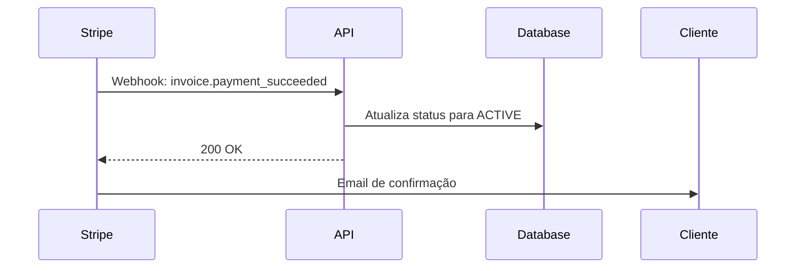
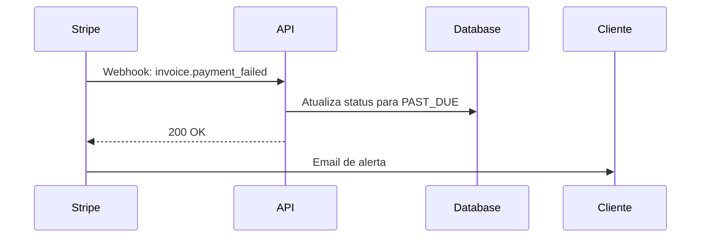
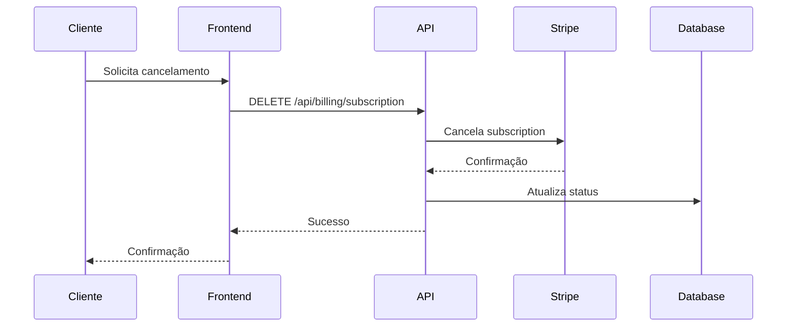

# 💳 Integração Stripe - FT9 Intelligence

## 📋 Visão Geral

Sistema completo de billing e pagamentos integrado com Stripe para gerenciar assinaturas, pagamentos e faturamento da plataforma FT9 Intelligence.

---

## 🔧 Configuração

### 1. Criar Conta Stripe

1. Acesse [https://dashboard.stripe.com/register](https://dashboard.stripe.com/register)
2. Crie uma conta Stripe
3. Complete a verificação da conta

### 2. Obter Chaves da API

1. Acesse [https://dashboard.stripe.com/apikeys](https://dashboard.stripe.com/apikeys)
2. Copie as chaves:
   - **Publishable key** (pk_test_...)
   - **Secret key** (sk_test_...)

### 3. Criar Produtos e Preços

#### Produto 1: FT9 Starter
```
Nome: FT9 Intelligence - Starter
Preço: R$ 497,00/mês
ID do Preço: price_starter_xxxxx
```

#### Produto 2: FT9 Professional
```
Nome: FT9 Intelligence - Professional
Preço: R$ 997,00/mês
ID do Preço: price_professional_xxxxx
```

#### Produto 3: FT9 Enterprise
```
Nome: FT9 Intelligence - Enterprise
Preço: R$ 2.997,00/mês
ID do Preço: price_enterprise_xxxxx
```

### 4. Configurar Webhook

1. Acesse [https://dashboard.stripe.com/webhooks](https://dashboard.stripe.com/webhooks)
2. Clique em "Add endpoint"
3. URL do endpoint: `https://seu-dominio.com/api/billing/webhook`
4. Selecione os eventos:
   - `customer.subscription.created`
   - `customer.subscription.updated`
   - `customer.subscription.deleted`
   - `invoice.payment_succeeded`
   - `invoice.payment_failed`
5. Copie o **Signing secret** (whsec_...)

### 5. Variáveis de Ambiente

Adicione no arquivo `.env`:

```bash
# Stripe
STRIPE_SECRET_KEY=sk_test_xxxxx
STRIPE_PUBLISHABLE_KEY=pk_test_xxxxx
STRIPE_WEBHOOK_SECRET=whsec_xxxxx
STRIPE_PRICE_STARTER=price_starter_xxxxx
STRIPE_PRICE_PROFESSIONAL=price_professional_xxxxx
STRIPE_PRICE_ENTERPRISE=price_enterprise_xxxxx
```

---

## 📡 Endpoints da API

### 1. Listar Planos

```http
GET /api/billing/plans
```

**Resposta:**
```json
{
  "plans": [
    {
      "id": "starter",
      "name": "Starter",
      "price": 497,
      "currency": "BRL",
      "interval": "month",
      "features": [...]
    },
    ...
  ]
}
```

### 2. Criar Assinatura

```http
POST /api/billing/subscription
Authorization: Bearer {token}
Content-Type: application/json

{
  "plan": "professional",
  "payment_method_id": "pm_xxxxx",
  "trial_days": 14
}
```

**Resposta:**
```json
{
  "success": true,
  "subscription": {
    "subscription_id": "sub_xxxxx",
    "status": "trialing",
    "trial_end": 1234567890
  }
}
```

### 3. Atualizar Assinatura (Upgrade/Downgrade)

```http
PATCH /api/billing/subscription
Authorization: Bearer {token}
Content-Type: application/json

{
  "new_plan": "enterprise"
}
```

**Resposta:**
```json
{
  "success": true,
  "subscription": {
    "subscription_id": "sub_xxxxx",
    "status": "active",
    "plan": "enterprise"
  }
}
```

### 4. Cancelar Assinatura

```http
DELETE /api/billing/subscription
Authorization: Bearer {token}
Content-Type: application/json

{
  "at_period_end": true
}
```

**Resposta:**
```json
{
  "success": true,
  "subscription": {
    "subscription_id": "sub_xxxxx",
    "status": "active",
    "cancel_at_period_end": true
  }
}
```

### 5. Portal do Cliente

```http
GET /api/billing/portal?return_url=https://app.ft9.com.br/dashboard
Authorization: Bearer {token}
```

**Resposta:**
```json
{
  "url": "https://billing.stripe.com/session/xxxxx"
}
```

### 6. Webhook Stripe

```http
POST /api/billing/webhook
Stripe-Signature: t=xxxxx,v1=xxxxx
Content-Type: application/json

{
  "type": "invoice.payment_succeeded",
  "data": {...}
}
```

---

## 🔄 Fluxo de Assinatura

### 1. Novo Cliente (Trial)



### 2. Fim do Trial (Pagamento)



### 3. Falha no Pagamento



### 4. Cancelamento



---

## 📊 Status de Assinatura

| Status | Descrição | Ação |
|:---|:---|:---|
| `TRIAL` | Período de teste (14 dias) | Acesso total |
| `ACTIVE` | Assinatura ativa e paga | Acesso total |
| `PAST_DUE` | Pagamento atrasado | Acesso limitado |
| `CANCELED` | Assinatura cancelada | Sem acesso |
| `SUSPENDED` | Suspensa manualmente | Sem acesso |

---

## 🎯 Planos e Recursos

### Starter (R$ 497/mês)
- ✅ 1.000 mensagens/mês
- ✅ 1 usuário
- ✅ Suporte por email
- ✅ WhatsApp Business API
- ✅ IA básica

### Professional (R$ 997/mês)
- ✅ 5.000 mensagens/mês
- ✅ 5 usuários
- ✅ Suporte prioritário
- ✅ WhatsApp Business API
- ✅ IA avançada com memória
- ✅ Automações básicas
- ✅ Dashboard analytics

### Enterprise (R$ 2.997/mês)
- ✅ Mensagens ilimitadas
- ✅ Usuários ilimitados
- ✅ Suporte 24/7
- ✅ WhatsApp Business API
- ✅ IA avançada com RAG
- ✅ Automações avançadas
- ✅ Dashboard analytics
- ✅ API dedicada
- ✅ White-label

---

## 🧪 Testes

### Testar com Cartões de Teste

Stripe fornece cartões de teste para simular diferentes cenários:

**Sucesso:**
```
Número: 4242 4242 4242 4242
CVC: Qualquer 3 dígitos
Data: Qualquer data futura
```

**Falha:**
```
Número: 4000 0000 0000 0002
```

**Requer autenticação 3D Secure:**
```
Número: 4000 0025 0000 3155
```

### Testar Webhooks Localmente

```bash
# Instalar Stripe CLI
brew install stripe/stripe-cli/stripe

# Login
stripe login

# Escutar webhooks
stripe listen --forward-to localhost:8000/api/billing/webhook

# Trigger evento de teste
stripe trigger invoice.payment_succeeded
```

---

## 🔒 Segurança

### Validação de Webhook

Todos os webhooks são validados usando a assinatura do Stripe:

```python
event = stripe.Webhook.construct_event(
    payload,
    stripe_signature,
    settings.stripe_webhook_secret
)
```

### Proteção de Rotas

Apenas administradores da organização podem:
- Criar assinaturas
- Atualizar planos
- Cancelar assinaturas
- Acessar portal do cliente

```python
@router.post("/subscription")
async def create_subscription(
    current_user: User = Depends(require_role([UserRole.ORG_ADMIN]))
):
    ...
```

---

## 📈 Métricas e Analytics

### Eventos Rastreados

- Criação de assinatura
- Pagamento bem-sucedido
- Falha de pagamento
- Upgrade/downgrade de plano
- Cancelamento de assinatura

### Integração com Analytics

Todos os eventos são logados e podem ser integrados com:
- Google Analytics
- Mixpanel
- Amplitude
- Segment

---

## 🚨 Tratamento de Erros

### Erros Comuns

| Erro | Causa | Solução |
|:---|:---|:---|
| `card_declined` | Cartão recusado | Solicitar outro método de pagamento |
| `insufficient_funds` | Saldo insuficiente | Aguardar ou usar outro cartão |
| `expired_card` | Cartão expirado | Atualizar método de pagamento |
| `invalid_cvc` | CVC inválido | Verificar código de segurança |

### Retry Logic

Stripe automaticamente tenta cobrar novamente em caso de falha:
- 1ª tentativa: Imediato
- 2ª tentativa: 3 dias depois
- 3ª tentativa: 5 dias depois
- 4ª tentativa: 7 dias depois

---

## 📚 Recursos Adicionais

- [Documentação Stripe](https://stripe.com/docs)
- [API Reference](https://stripe.com/docs/api)
- [Webhooks Guide](https://stripe.com/docs/webhooks)
- [Testing Guide](https://stripe.com/docs/testing)

---

**Fim da Documentação de Integração Stripe**  
*FT9 Intelligence Platform*
